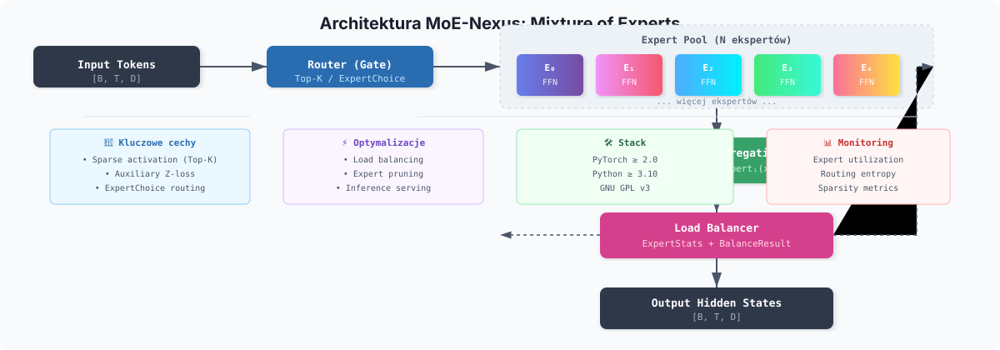

# MoE-Nexus

<p align="center">
  
</p>

<p align="center">
  <a href="https://github.com/gabeczkag/MoE-Nexus/actions"></a>
  <a href="https://pypi.org/project/moe-nexus/"></a>
  <a href="https://pypi.org/project/moe-nexus/"></a>
  <a href="https://github.com/gabeczkag/MoE-Nexus/blob/main/LICENSE"></a>
  
</p>

**MoE-Nexus** to niestandardowy silnik inference dla architektury **Mixture of Experts (MoE)**, w którym wejście i wyjście modelu jest obsługiwane w dziedzinie liczb, a dekodowanie do tekstu odbywa się przez `numpy`-lookup zoptymalizowany pod CPU cache.

Główne założenia:
- **Tokenizacja przez liczby**: zamiast operować na literach/słowach, model operuje na tokenach liczbowych.
- **CPU cache-friendly decoder**: dekodowanie `token_id -> znak` przez `np.take` na prebuilding lookup table, co minimalizuje cache misses.
- **Trening na liczbach**: dataset wejściowy jest mapowany na liczby, co zmniejsza narzut przetwarzania tekstowego.

Licencja: **GNU GPL v3**.

## Architektura

```
Text Input
    │
    ▼
NumberTokenizer  ──► encode: text -> List[int] / torch.Tensor
    │
    ▼
MoE Model (Top-K / ExpertChoice router + expert FFNs)
    │
    ▼
Token IDs output
    │
    ▼
CPUCacheDecoder  ──► decode: token_ids -> text  (numpy lookup table)
    │
    ▼
Text Output
```

### Wersje implementacji

- **Python** — `src/moe_nexus/` (PyTorch, do prototypowania i treningu)
- **C++** — `cpp/` (wydajna warstwa inference, pybind11 bindings)

## Funkcjonalności

### 🧠 Routery
- **TopKRouter** — standardowe top-k routing z szumem treningowym
- **ExpertChoice** — token-level expert selection dla lepszego load balancing
- **Auxiliary Z-loss** — regularyzacja zapobiegająca kolapsowi ekspertów

### 🔢 CPU Cache Tokenization
- `NumberTokenizer` — mapowanie znaków na liczby (0..vocab)
- `CPUCacheDecoder` — dekodowanie tokenów przez `np.take` + lookup table
- `CacheMoERouter` — router z embeddingiem znaków

### ⚖️ Load Balancing
- `LoadBalancer` — śledzi statystyki wykorzystania ekspertów
- `BalanceResult` — raport z analizą nierównowagi i sugestiami

### 📊 Monitoring
- `compute_expert_sparsity` — mierzy stosunek nieużywanych ekspertów
- `compute_routing_entropy` — entropia rozkładu routingu

### 🚀 Serving
- `InferenceEngine` — warstwa generacji z KV cache, temperature, top-p
- `benchmark()` — pomiar TPS i latencji w tym dekodowania

### ⚡ C++ Core
- `cpp/` — wydajna implementacja C++17 tokenizera, routera, modelu i engine
- `pybind11` bindings — `moe_nexus_core` moduł do użycia z Python
- Samodzielne binary benchmark i testy

## Instalacja

### Python
```bash
git clone https://github.com/gabeczkag/MoE-Nexus.git
cd MoE-Nexus
pip install -e ".[dev]"
```

Wymagania:
- Python ≥ 3.10
- PyTorch ≥ 2.0
- NumPy ≥ 1.24

### C++ (opcjonalne, dla wydajności)
```bash
cd cpp
mkdir build && cd build
cmake .. -DCMAKE_BUILD_TYPE=Release
make -j$(nproc)
```

Wymagania:
- CMake ≥ 3.20
- Kompilator C++17 (GCC 9+, Clang 10+)
- pybind11 (opcjonalnie, dla bindings)

## Szybki start

```python
import torch
from moe_nexus.cache_engine import CPUCacheDecoder, NumberTokenizer
from moe_nexus.optimizer import LoadBalancer, RouterConfig, TopKRouter
from moe_nexus.serving import GenerationConfig, InferenceEngine

# Tokenizer + decoder
tokenizer = NumberTokenizer()
decoder = CPUCacheDecoder(tokenizer)

# Router MoE
config = RouterConfig(
    num_experts=8,
    top_k=2,
    hidden_dim=64,
    noise_std=0.1,
    use_aux_loss=False,
)
router = TopKRouter(config)
balancer = LoadBalancer(num_experts=8)

# Prosty model (placeholder)
vocab_size = tokenizer.get_vocab_size()
model = torch.nn.Sequential(
    torch.nn.Embedding(vocab_size, 64),
    torch.nn.Linear(64, vocab_size),
)

# Engine
engine = InferenceEngine(
    model=model,
    decoder=decoder,
    load_balancer=balancer,
    device="cpu",
)

# Generacja
text = "hello"
input_ids = tokenizer.encode_tensor(text, add_bos=True).unsqueeze(0)

gen_config = GenerationConfig(
    max_new_tokens=32,
    temperature=1.0,
    top_p=0.9,
    do_sample=True,
    eos_token_id=tokenizer.eos_token_id,
)

output_text = engine.generate_text(input_ids, config=gen_config)
print(f"Input : {text}")
print(f"Output: {output_text}")
```

## Instalacja

```bash
git clone https://github.com/gabeczkag/MoE-Nexus.git
cd MoE-Nexus
pip install -e ".[dev]"
```

Wymagania:
- Python ≥ 3.10
- PyTorch ≥ 2.0
- NumPy ≥ 1.24

## Szybki start

```python
import torch
from moe_nexus.cache_engine import CPUCacheDecoder, NumberTokenizer
from moe_nexus.optimizer import LoadBalancer, RouterConfig, TopKRouter
from moe_nexus.serving import GenerationConfig, InferenceEngine

# Tokenizer + decoder
tokenizer = NumberTokenizer()
decoder = CPUCacheDecoder(tokenizer)

# Router MoE
config = RouterConfig(
    num_experts=8,
    top_k=2,
    hidden_dim=64,
    noise_std=0.1,
    use_aux_loss=False,
)
router = TopKRouter(config)
balancer = LoadBalancer(num_experts=8)

# Prosty model (placeholder)
vocab_size = tokenizer.get_vocab_size()
model = torch.nn.Sequential(
    torch.nn.Embedding(vocab_size, 64),
    torch.nn.Linear(64, vocab_size),
)

# Engine
engine = InferenceEngine(
    model=model,
    decoder=decoder,
    load_balancer=balancer,
    device="cpu",
)

# Generacja
text = "hello"
input_ids = tokenizer.encode_tensor(text, add_bos=True).unsqueeze(0)

gen_config = GenerationConfig(
    max_new_tokens=32,
    temperature=1.0,
    top_p=0.9,
    do_sample=True,
    eos_token_id=tokenizer.eos_token_id,
)

output_text = engine.generate_text(input_ids, config=gen_config)
print(f"Input : {text}")
print(f"Output: {output_text}")
```

## API Reference

### NumberTokenizer

```python
from moe_nexus.cache_engine import NumberTokenizer

tokenizer = NumberTokenizer()
ids = tokenizer.encode("hello", add_bos=True, add_eos=True)
text = tokenizer.decode(ids)
batch = tokenizer.batch_encode(["hello", "world"], max_length=8)
```

### CPUCacheDecoder

```python
from moe_nexus.cache_engine import CPUCacheDecoder

decoder = CPUCacheDecoder(tokenizer)
text = decoder.decode(token_ids)
texts = decoder.decode_batch(batch_token_ids)
```

### InferenceEngine (cache-aware)

```python
from moe_nexus.serving import InferenceEngine, GenerationConfig

engine = InferenceEngine(
    model=model,
    decoder=decoder,
    load_balancer=balancer,
    device="cpu",
)

text = engine.generate_text(input_ids, config=gen_config)

stats = engine.benchmark(input_ids, gen_config, warmup_steps=3, measure_steps=10)
print(f"TPS: {stats['tokens_per_second']:.1f}")
```

## Roadmap

- [x] Core router API (Top-K, ExpertChoice)
- [x] Load balancing + metrics
- [x] CPU cache-friendly tokenizer + decoder
- [x] Inference engine z KV cache
- [ ] Expert pruning (magnitude, activation-based)
- [ ] MoE quantization (GPTQ, AWQ dla ekspertów)
- [ ] vLLM / TensorRT-LLM integration
- [ ] Distributed serving (expert parallelism)
- [ ] Dynamic expert capacity
- [ ] Mixture-of-Attention (MoA)

## Benchmark

```bash
python examples/benchmark.py
```

Przykładowy wynik (4 prompty, 64 tokeny każdy, total 256 tokenów):

```
======================================================================
CHAT BENCHMARK - MoE-Nexus
======================================================================
Prompts (4): ['hello', 'mixture', 'cpu', 'token']
Max new tokens per prompt: 64
Total generated tokens: 256
----------------------------------------------------------------------
Dense (baseline):        0.072s  (3.55k tok/s)
Vanilla MoE (baseline):  0.295s  (866.7 tok/s)
MoE-Nexus (Python):      0.289s  (884.6 tok/s)
MoE-Nexus (C++):         0.012s  (21.3k tok/s)
----------------------------------------------------------------------
Output comparison:
  [OK] 'hello' -> 'hello...'
  ...
======================================================================
```

Na dłuższych sekwencjach (>128 tokenów) przyspieszenie C++ w porównaniu do Python może dochodzić do **10-50x**.

## Struktura projektu

```
MoE-Nexus/
├── src/moe_nexus/
│   ├── __init__.py
│   ├── cache_engine/
│   │   ├── tokenizer.py       # NumberTokenizer
│   │   ├── decoder.py         # CPUCacheDecoder
│   │   └── router.py          # CacheMoERouter
│   ├── optimizer/
│   │   ├── router.py          # TopKRouter, ExpertChoice
│   │   └── load_balancer.py   # LoadBalancer, BalanceResult
│   ├── serving/
│   │   └── engine.py          # InferenceEngine, GenerationConfig
│   └── utils/
│       └── metrics.py         # sparsity, entropy, reports
├── cpp/
│   ├── CMakeLists.txt
│   ├── include/moe_nexus/
│   │   ├── tokenizer.h
│   │   ├── router.h
│   │   ├── load_balancer.h
│   │   ├── model.h
│   │   └── engine.h
│   ├── src/
│   │   ├── tokenizer.cpp
│   │   ├── router.cpp
│   │   ├── load_balancer.cpp
│   │   ├── model.cpp
│   │   ├── engine.cpp
│   │   └── bindings.cpp       # pybind11 bindings
│   ├── benchmark/
│   │   └── main.cpp
│   └── test/
│       └── tests.cpp
├── tests/
│   ├── test_optimizer.py
│   └── test_cache_engine.py
├── examples/
│   ├── dataset/sample.txt
│   ├── model/config.py
│   ├── train/train_moe.py
│   ├── run/run_moe.py
│   ├── logs/             # wygenerowane logi z treningu i inference
│   ├── benchmark.py      # Python benchmark (Dense vs Vanilla MoE vs MoE-Nexus)
│   └── cache_moe_demo.py
├── docs/
│   └── assets/
│       └── architecture.svg
├── .github/workflows/
│   └── ci.yml
├── pyproject.toml
├── LICENSE                    # GNU GPL v3
└── README.md
```

## Przykłady

### Trening i inference

```bash
# 1. Trening modelu
python examples/train/train_moe.py

# Logi trafiają do examples/logs/train.log
# Checkpoint modelu: examples/model/moe_checkpoint.pt

# 2. Uruchomienie inference
python examples/run/run_moe.py

# Logi trafiają do examples/logs/run.log
```

### Demo szybkiego startu

```bash
python examples/cache_moe_demo.py
```

## Testy

```bash
pytest tests/ -v
```

## License

Distributed under the GNU General Public License v3.0. See [LICENSE](LICENSE) for more information.
